# **Helium Mining Rewards Analysis**

## **Team members**
### Andrew McCoy
### Andrew Hidalgo
### Nadia Nadir
### Krishan Kandial

## **Project Description**
Pull data from the Helium Network using an API to analyze rewards earned for particular hotspots.

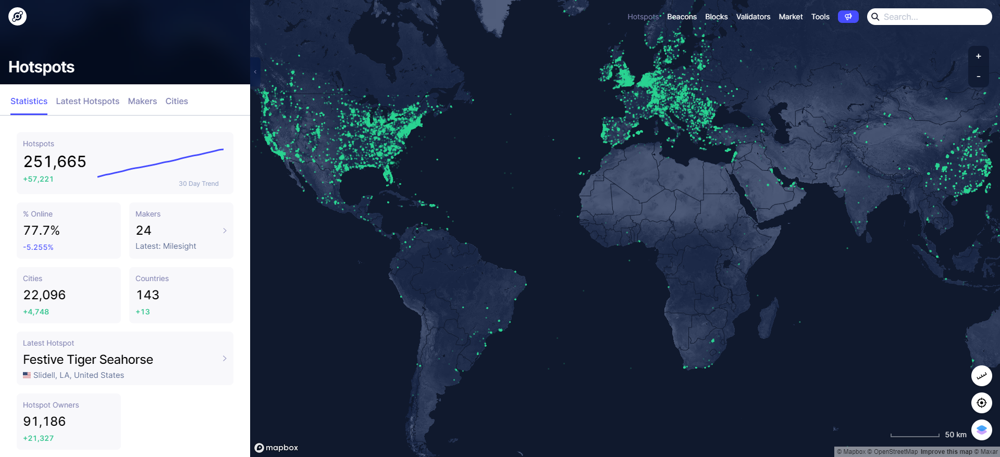

### **Background**
What is **Helium**? People-Powered Network by:
* Mining Crypto with Radio

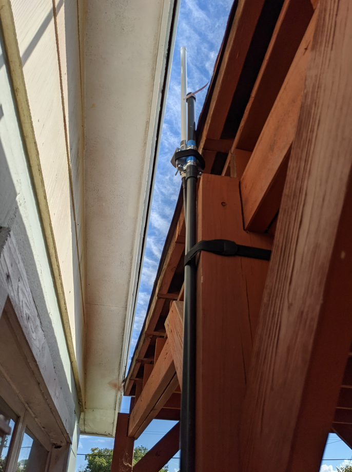

* Stake (Proof of Coverage) over the Helium Blockchain 

* Use the Network (Agriculture, Enviroment Monitoring, Logistics & Supply Chain, Water Monitoring, etc.)

### **Research Questions and project tasks**

#### What is last 30 days rewards for each hotspot?

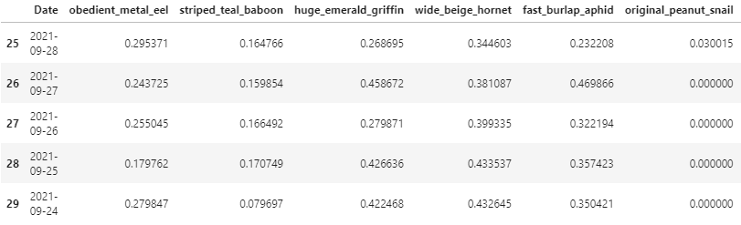

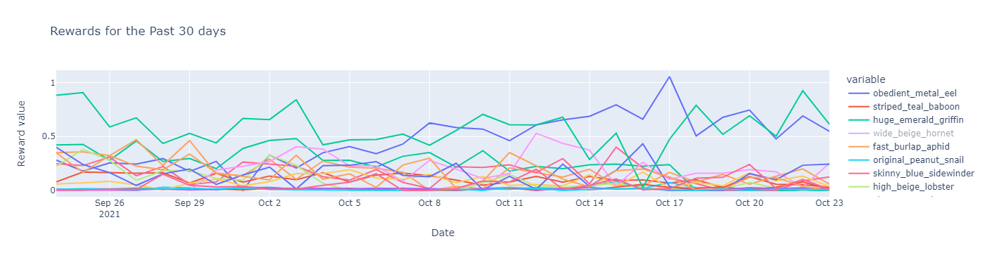

#### What is the cummulative rewards per hotspot over the last 30 days per hot?
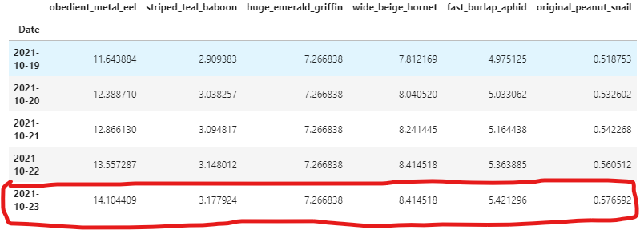

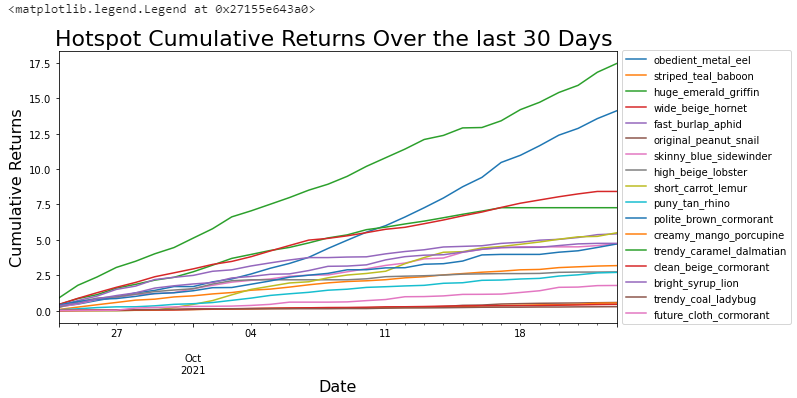

#### What is the average reward for a given hotspot over the last 30 days?

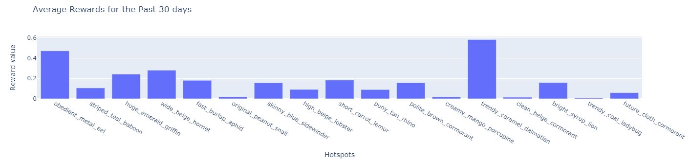

#### Where is each hotspot located on a Map?

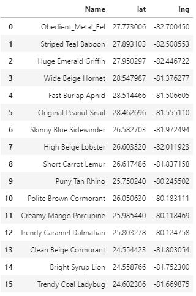

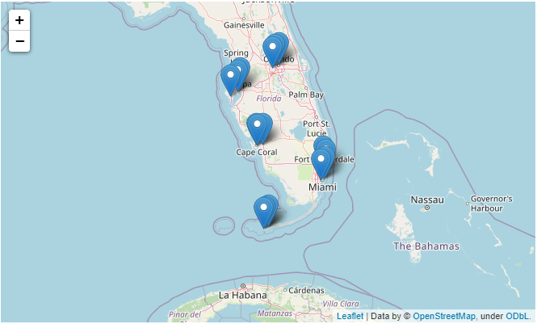

#### What is the standard deviation of daily rewards for a given hotspot over the last 30 days?

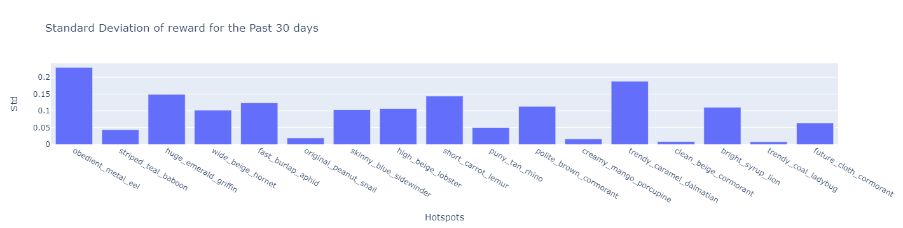

#### What is the current price of HNT Token in USD?

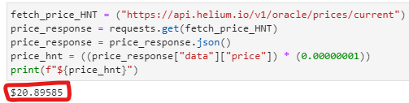

#### What is the NPV for a given hotspot for a given discount rate?
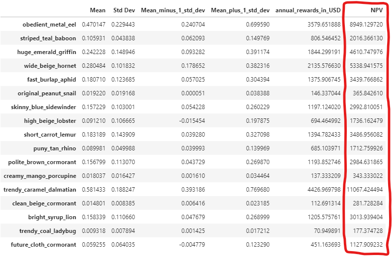

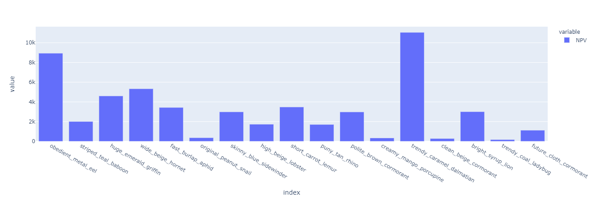

#### What is the projected total rewards (HNT Token and USD) earned for a given hotspot over the next 30, 60, 90 days?

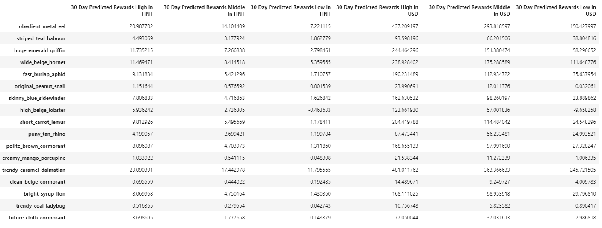
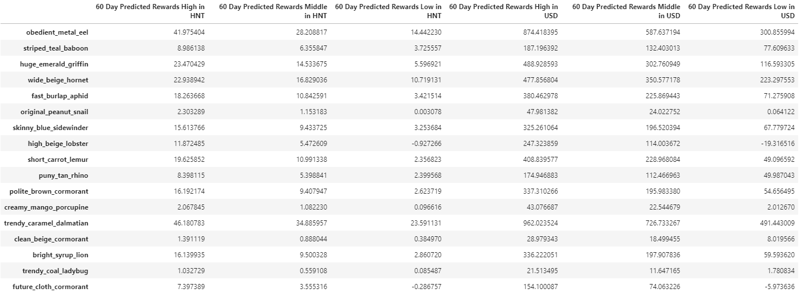
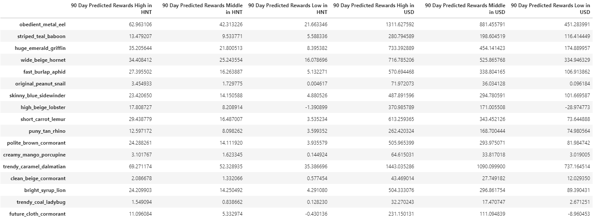

#### Which Hotspots rewards are most consistent?
Using the standard deviation bar chart it shows that four of the hotspots are consistent in earning rewards. 

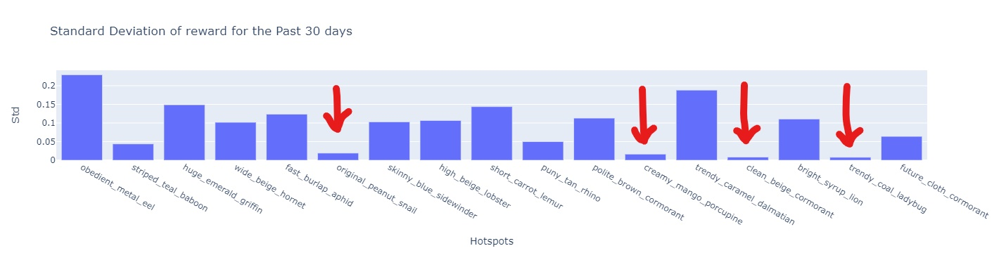

#### In what areas most profitable to place a hotspot?
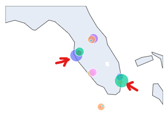

